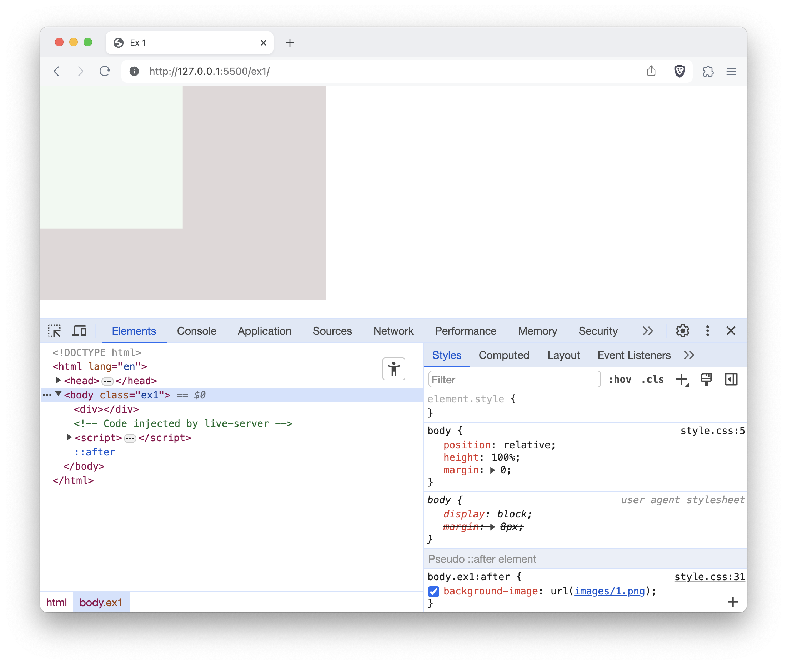
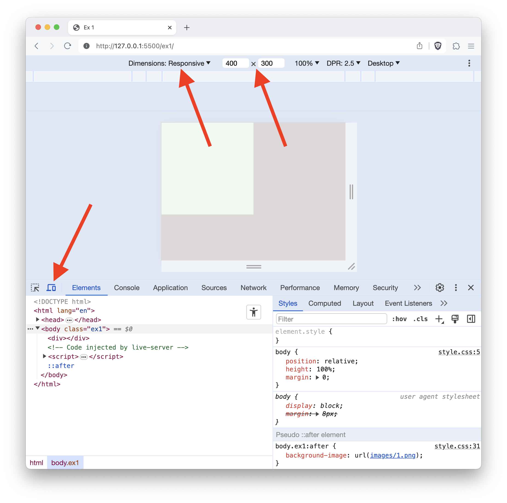
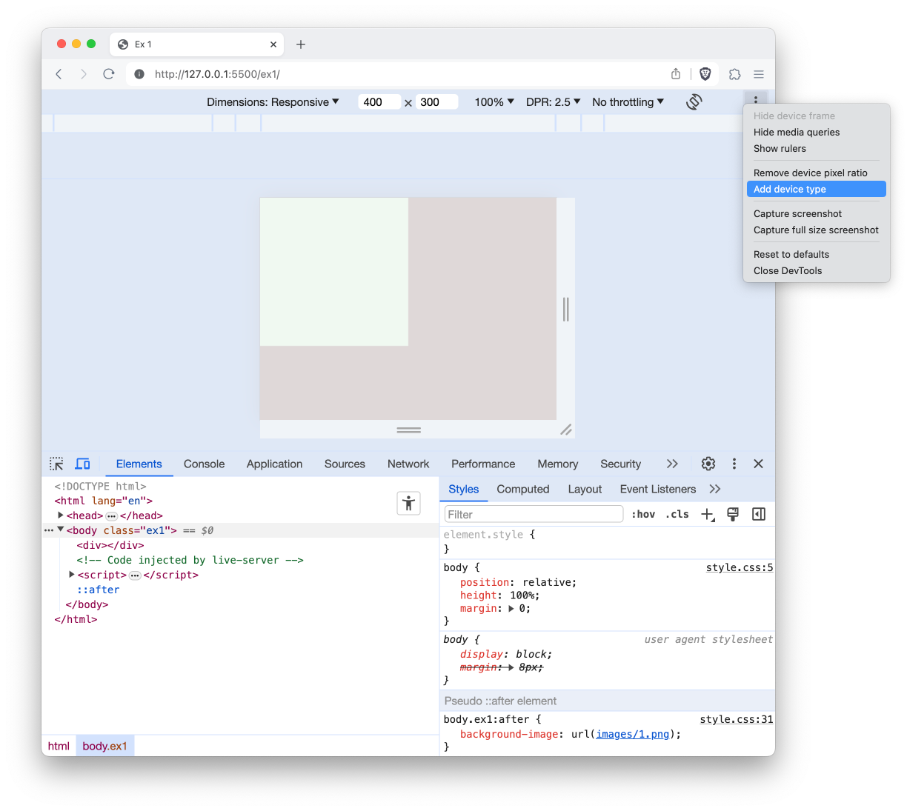
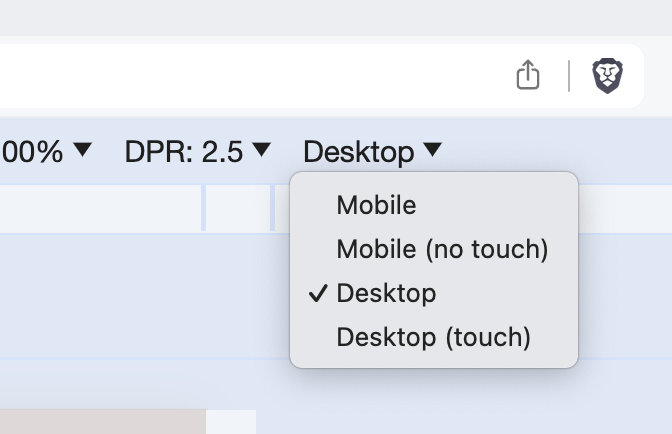

# Exercice CSS Golf

## Objectif

Chaque exercice présente une image en filigrane et votre tâche est de recréer cette image en utilisant le moins de code possible.

## How to

1. Clonez ce dépôt (Github Desktop)
1. Ouvrez le projet dans votre navigateur. (avec le bouton "Go Live" de l'exension Live Server de Visual Studio Code ou comme vous le souhaitez)
1. Rendez-vous sur l'exercice 1 à l'URL `/ex1`
1. Ouvrez le fichier `/ex1/index.html` et commencez à écrire votre code HTML pour reproduire l'image en filigrane.
1. Ouvrez le fichier `/ex1/ex1.css` et commencez à écrire votre code CSS pour reproduire l'image en filigrane.
1. Quand vous passez votre souris dans le navigateur, l'image en filigrane s'affiche au dessus de votre travail. Utilisez cette fonctionnalité pour comparer votre travail à l'image en filigrane.
1. Quand on ne voit plus de différence, c'est que c'est fini!

### Dev tools

1. Ouvrez DevTools (clic droit ou `Cmd+Shift+I`)
   
1. Activez le mode "Responsive" et définissez une taille de 400x300
   
1. Ajoutez le "device type" aux outils de personnalisation du mode responsive
   
1. Changez le "device type" pour "Desktop"
   
